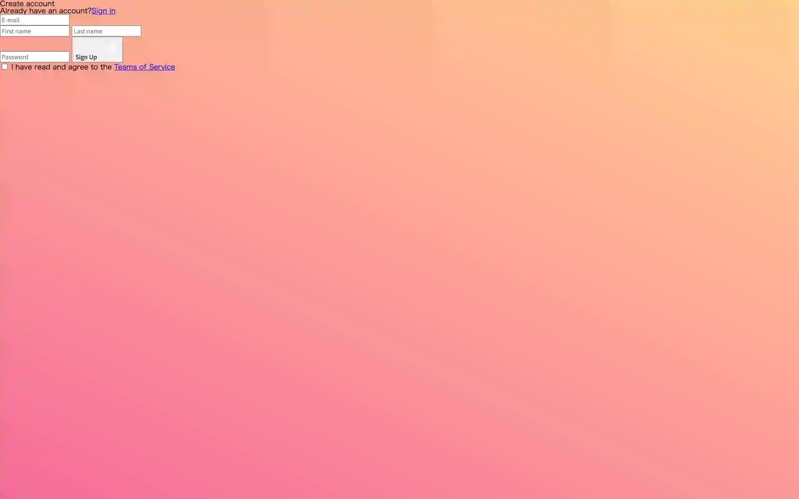
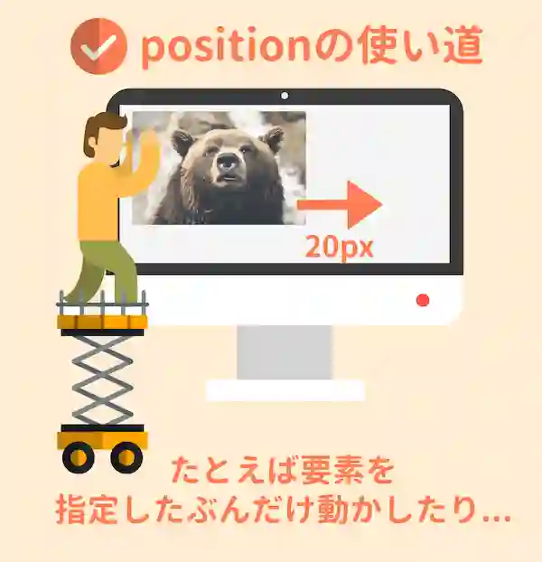
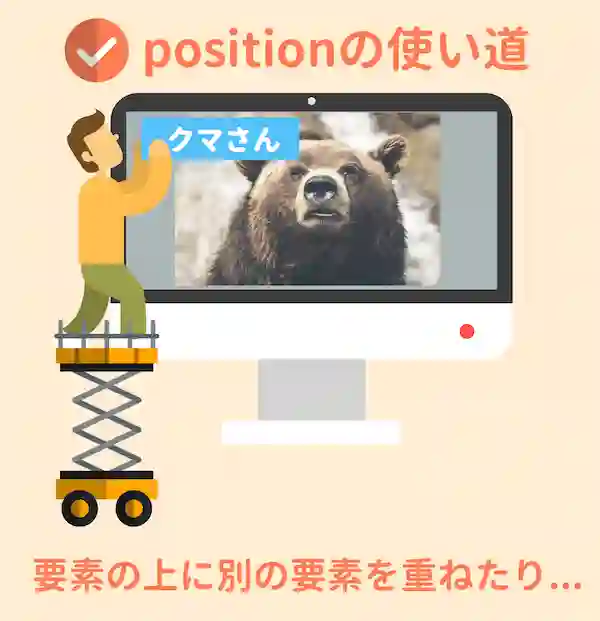
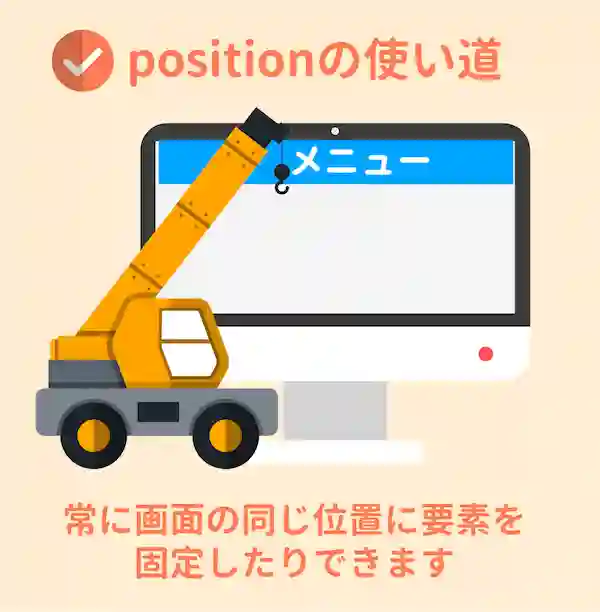
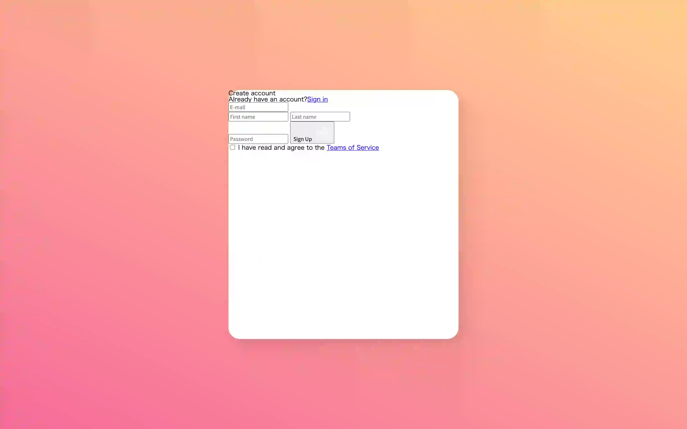
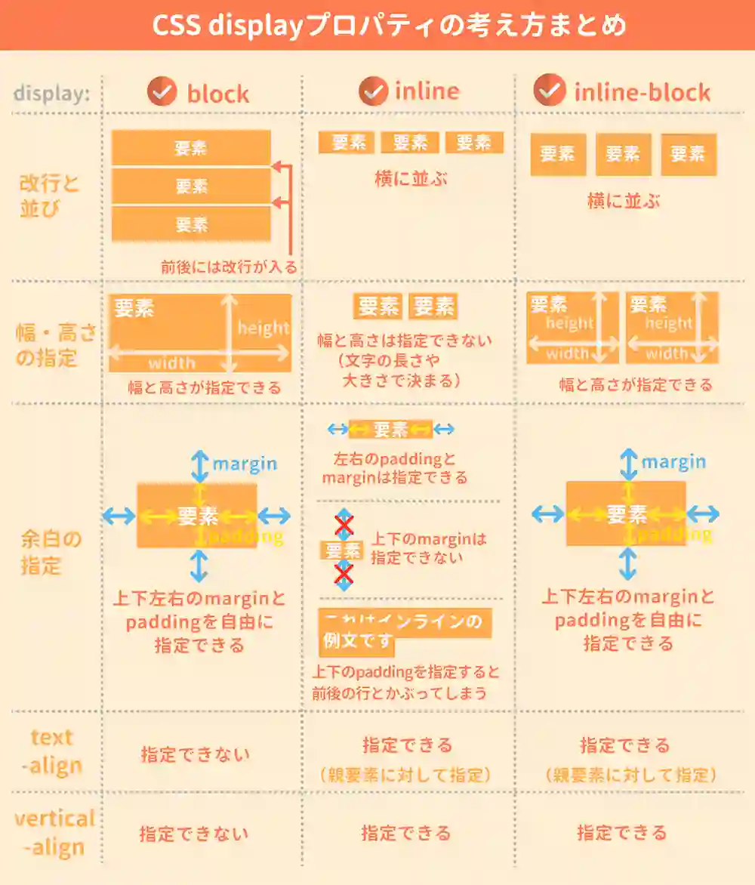
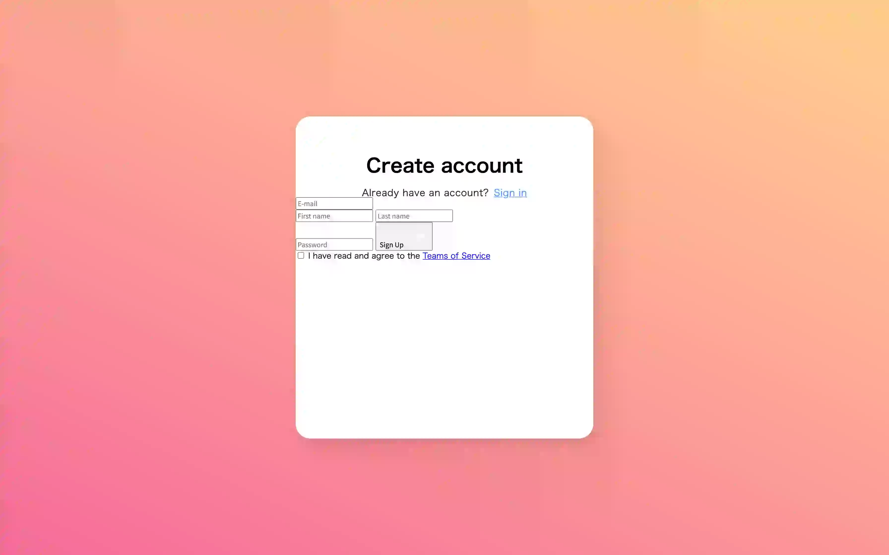

今回は，お題のデザインを実際にコーディングしていきながら，出てきた項目について解説していく形式で進めたいと思います．

今回このテーマを選んだ理由は，あまりレスポンシブを意識せずに作成でき，かつBootstrap等のCSSフレームワークがなくともそこまで労力の差がないデザインだからです．

CSSのプロパティなどを片っ端から勉強していくのもいいとは思いますが，実際にコーディングしながら習得していく方がよく使うプロパティから順に覚えていくことができ，楽しいのではないかと思います！

> 2020/10/20 (水) 電子計算機研究会 第1回 CSS講座

# 今回作成するもの
https://smpny7.github.io/css-course/ ←これ

# 環境構築
エディタは強制はしませんが，VSCodeを使って解説していきます！


> **注意** 画像サイズ圧縮のため，WebP画像フォーマットを使用しております．画像が表示されない場合，最新のブラウザに更新してください．


<!----------------------------------------------------------------------------->
# 1. 背景周りの処理
早速内容に入っていきます！
まずは手前のカード部分を含まない，奥のグラデーション部分を中心にコーディングしていきます．

## 1-1. 背景色を設定
bodyタグを編集していきます．
背景色を編集するには，`background`というプロパティを使います．
CSSは普通，以下のように記述します．

```css
body {
    background: red;
}
```

`background-color`というプロパティも同様に使えます．

```css
body {
    background-color: red;
}
```

基本的には，色コードで指定することが多いです．

```css
body {
    background: #0ecfff;
}
```

`background`プロパティではいろいろなことができます．
例えば，背景にイメージを適用することもできます．

```css
body {
    background: no-repeat url("./img/sample.webp");
}
```

また，背景にグラデーションをかけることもできます．
今回は，以下のグラデーションを使っていきます．

```css
body {
    background: linear-gradient(25deg, #ee4d83da, #FFC778da);
}
```

今回はSafariやFirefoxなどのブラウザにも対応させるために，ベンダープレフィックスをつけた2行も追記しておきます．

```css
body {
    background: -moz-linear-gradient(65deg, #ee4d83da, #FFC778da);
    background: -webkit-linear-gradient(65deg, #ee4d83da, #FFC778da);
    background: linear-gradient(25deg, #ee4d83da, #FFC778da);
}
```

> **ベンダープレフィックスとは** プロパティ名の前に書く「-webkit-」「-moz-」「-o-」「-ms-」などの文字のこと．これを書くことで古いブラウザにCSS3のプロパティを対応させることができる．[^1]


## 1-2. 高さの変更
背景のグラデーションは実装できましたが，現段階ではグラデーションが繰り返し表示されていると思います．
これは，`body`の高さがbody内部の要素の最上部から最下部までと認識しているからです．

高さを指定するには`height`プロパティを使用します．
height・widthプロパティについては2章で後述します．

とりあえず，`body`の高さを画面全体の高さに設定しましょう．

```css
body {
    background: -moz-linear-gradient(65deg, #ee4d83da, #FFC778da);
    background: -webkit-linear-gradient(65deg, #ee4d83da, #FFC778da);
    background: linear-gradient(25deg, #ee4d83da, #FFC778da);

    /* 追記 */
    height: 100vh;
}
```

## 1-3 まとめ
* 基本的なCSSの書き方を理解しました (ほぼ口頭だったと思いますが)
* `background`プロパティについて理解しました
* 各ブラウザのバージョンに対応させるため，グラデーションなど一部の機能には**ベンダープレフィックス**を複数用いて対応させる必要があることを理解しました

↓ 現段階のデザインはこんな感じです．



---

<!----------------------------------------------------------------------------->
# 2. Positionについて理解しよう
この章では，手前のカードの枠組みを作りながら`position`の考え方に触れてみます．

## 2-1. セレクタの指定方法
今までセレクタを指定するには，

```css
body {
    (プロパティ): (値);
}
```

という風に，直接タグを指定してきたと思います．
しかし，html内には同じタグを複数使用する場合があります．
それらを区別するために，htmlのタグ内に`class`というものを追記します．

```html
<h1>Create account</h1>

<!-- ↓ class属性を持たせる -->

<h1 class="title">Create account</h1>
```

この場合，cssでプロパティを与えていくには，

```css
.title {
    (プロパティ): (値);
}
```

という風に，クラス名の先頭に`.`をつけます．
class名は，同じhtml内に複数同じ名前のものをつけることができます．

また，同じような動作をするものに`id`というものがあります．`class`と同様に，

```html
<h1>Create account</h1>

<!-- ↓ class属性を持たせる -->

<h1 id="title">Create account</h1>
```

という風につけることができます．この場合セレクタは

```css
#title {
    (プロパティ): (値);
}
```

という風に，クラス名の先頭に`#`をつけてあげることで指定できます．
`id`は`class`と違って，同じ名前のものはhtml内に1つしか付けられません．

---

では実際に，`container`クラスの背景色を変えてみましょう．

```css
.container {
    background: #ffffff;
}
```

> **idとclassの違い** idの方がclassよりも優先度が高かったり，JavaScriptを使用する際にidの方が高速であったり，いろいろな違いがあります．今回のhtmlでも1ヵ所だけidを使っていますが，その理由は後述します．[^2]


## 2-2. 高さ・横幅の設定
とりあえず2章ではレスポンシブは考慮せず，カードを上下左右の中央に固定値で表示させてみたいと思います．

高さや横幅を指定したい場合には，それぞれ`height`・`weight`プロパティを使用します．

```css
.container {
    height: 300px;
    width: 500px;
}
```

また，`%`指定することもできます

```css
.container {
    height: 30%;
    width: 50%;
}
```

この`%`は親要素に依存してしまうため，ブラウザの画面全体からみた`%`にならない場合が多いです．
1章でしたように，ブラウザの全体からみた`%`を使いたい場合には以下の単位を使用するのが確実です．

```css
.container {
    height: 30vh;
    width: 50vw;
}
```

ブラウザの高さを100等分した1つの長さが`1vh`となり，ブラウザの横幅を100等分した1つの長さが`1vw`となります．

> **親要素とは** 自身のタグを含むように囲まれているタグの中で，1つ上の階層のものである．今回の例では，`form`の親要素は`body`，`button`の親要素は`body`である．

---

今回は以下のように設定します．

```css
.container {
    background: #ffffff;

    /* 追記 */
    height: 700px;
    width: 600px;
}
```

## 2-3. 角を丸くする
カードを角丸にしていこうと思います．`border-radius`というプロパティを使うと，指定したピクセル数の半径で角を丸くすることができます．

```css
.container {
    background: #ffffff;
    height: 700px;
    width: 600px;

    /* 追記 */
    border-radius: 30px;
}
```

## 2-4. 影をつける
影をつけるにはいろいろな方法があります．昔は`box-shadow`がよく使われていましたが，近年ではPNG画像の透過ややSVG図形に対応した`filter`を使うことが多いです．


```css
.container {
    background: #ffffff;
    height: 700px;
    width: 600px;
    border-radius: 30px;

    /* 追記 */
    filter: drop-shadow(10px 10px 10px rgba(0,0,0,0.1));
}
```

`drop-shadow("x" "y" "blur" "color");`という書き方をしています．中心から`(x,y)`ピクセルずらしたところに，`blur`（範囲）を指定してシャドウをかけます．`color`の部分は透過させるため，RGBAカラーモデルを使用しています．詳しくは[こちら](http://www.htmq.com/css3/rgba.shtml)．

## 2-5. 画面の中央に配置
ここでは`position`プロパティを使っていきます．
`position`とは要素の位置を指定する時に用い，CSSを使っていく上で非常によく使う考え方になります．

`position`プロパティには4つの値が設定できます．

| プロパティ | 値 | 説明 |
| :---: | :--- | :--- |
| **position** | *static* | 初期値はこれ．指定することはほとんどない |
|| *relative* | 現在の位置を基準に相対的な位置を決める |
|| *absolute* | 親要素を基準に絶対的な位置を決める |
|| *fixed* | 画面のきまった位置に固定する |

`position`は基本的に`top`・`bottom`・`left`・`right`というプロパティとセットで使います．イメージとしては，以下のようになります．

1. `positon`で基準を決める
2. `top` `bottom` `left` `right`で具体的な位置を数字で調整

ここからは，私のおすすめする技術サイト[サルワカ](https://saruwakakun.com/)にまとめられているので，下記リンクのページを使って説明していきます．

> [CSSのpositionを総まとめ！absoluteやfixedの使い方は？ | サルでも分かる図解説明マガジン ](https://saruwakakun.com/html-css/basic/relative-absolute-fixed)

---

イメージ的にはこんな感じになったと思います．



↑ `relative`は現在の位置から相対的に移動させることができます．



↑ `absolute`は親要素からの位置を指定できるため，他の要素と被せたりするときに使います．
注意するのは，親要素が`relative`である必要があることです．



↑ `fixed`はスクロールしても変わらない位置に表示させるヘッダーなどに使います．

> 画像は上記サイトから拝借（https://saruwakakun.com/html-css/basic/relative-absolute-fixed）

---

今回，`absolute`を使ってもいいのですが，この画面ではスクロールすることがないと思うので，実装が簡単な`fixed`を使っていきたいと思います．

```css
.container {
    background: #ffffff;
    height: 700px;
    width: 600px;
    border-radius: 30px;
    filter: drop-shadow(10px 10px 10px rgba(0,0,0,0.1));

    /* 追記 */
    position: fixed;
    top: 0;
    bottom: 0;
    right: 0;
    left: 0;
    margin: auto;
}
```

`position`の値を`fixed`にして，上下左右からの距離を0にすることで，両側から引っ張られるイメージで要素が中央にきます．またこれには`margin: auto;`というのが必要になってきます．
`margin`・`padding`については3章で触れていきます．

> **発展的な内容** 一般的に`margin`の初期値は`auto`になっており，両端からの距離が0であれば自動で`margin`が等幅に設定され要素が中央に来るはずです．ここで，"一般的に" と言ったのは，ブラウザごとに初期値が異なる場合があります．そのため**リセットCSS**というものを使って，初期値を全ブラウザ統一しています．リセットCSSでは`margin`は0になります．そのため，ここではmarginを初期値`auto`に戻しました．

上記の`margin: auto;`の説明は若干レベルの高い話なので，理解する必要はありません．

とりあえず要素を中央に持ってきたい場合の手順をもう一度おさらいします．以下のコードと手順をみながら整理していきましょう．（以下の例では左右中央に要素を持ってきたい場合です．）

1. `position`を`absolute`や`fixed`に設定する． (注: `absolute`の親要素は`relative`の必要あり)
2. 中央に持ってきたい要素の両端 (例: `left`と`right`) を0にする．
3. `margin`を`auto`にする．(具体的には`margin-left`と`margin-right`だけを`auto`にするだけでOK)

```css
.container {
    position: fixed;       /* 手順1 */
    left: 0;                     /* 手順2 */
    right: 0;                  /* 手順2 */
    margin: auto;         /* 手順3 */
}
```

**この方法は丸暗記で大丈夫です！**

## 2-6 まとめ
* タグ以外にも，`id`や`class`を用いて要素のデザインを変更できることを理解しました
* `height`・`width`プロパティについて理解しました
* `border-radius`プロパティを使って角丸にする方法を理解しました
* `filter`プロパティを使って影をつける方法を理解しました
* `position`プロパティには4種類の役割があり，活用することで様々なデザインが作れることを理解しました
* 要素を中央寄せする簡単な3つの手順を理解しました

↓ 現段階のデザインはこんな感じです．



---

<!----------------------------------------------------------------------------->
# 3. Display要素について理解しよう
この章では，手前のカードの中身を作りながら`margin`・`padding`の考え方に触れてみます．

## 3-1. 文字関係のプロパティ
まずは，タイトルとサインインラベルの文字を装飾していきたいと思います．
ここでは，**文字サイズ**・**文字の太さ**・**文字の色**・**文字間の距離**を指定する方法を説明します．

**文字サイズ**を変更するには，`font-size`プロパティを変更します．

```css
.title {
    font-size: 38px;
}
```

フォントサイズの指定方法には`px`以外にも，`%`や`vw`等も使えます（あまり使いませんが）．
レスポンシブなフォントサイズにするには，`rem`がよく使われます．

文字の太さを変更するには，`font-weight`プロパティを使用します．

```css
.title {
    font-weight: bold;
}
```

文字の色を変更するには，`color`プロパティを使用します．

```css
.signin {
    color: #1f1f1f;
}
```

VSCodeのカラーピッカーを使うと，手軽に色を選択できるので便利です．

最後に文字間の距離を指定する方法です．
`letter-spacing`というプロパティを使います．

```css
.signin {
    letter-spacing: .5px;
}
```

この`font-size`・`font-weight`・`color`・`letter-spacing`という4つのプロパティはよく使うので覚えておきましょう．

### 課題

以下のように設定してください．

- **title**プロパティ
    - 文字サイズ `38px`
    - 文字の太さ `bold`
- **signin**プロパティ
    - 色 `"1f1f1f`
    - 文字サイズ `19px`
    - 文字間の距離 `0.5px`

### 模範解答

```css
.title {
    font-size: 38px;
    font-weight: bold;
}

.signin {
    color: #1f1f1f;
    font-size: 19px;
    letter-spacing: .5px;
}
```

## 3-2. Display要素の種類
ここでは`display`プロパティについて解説していきます．
それぞれのタグには初期値が設定されており，CSSを使っていく上で非常によく使う考え方になります．

`display`プロパティには4つの値があります．

| プロパティ | 値 | タグの初期値 |
| :---: | :--- | :--- |
| **display** | *block* | p，div，h1〜h6 など |
|| *inline* | a，span，img など |
|| *inline-block* | - |
|| *none* | - |

それぞれの違いは以下のようになります．



この講座では，[サルワカ](https://saruwakakun.com/)というサイトを使いながら説明していきます．

> [displayの使い方を総まとめ！inlineやblockの違いは？ | サルでも分かる図解説明マガジン ](https://saruwakakun.com/html-css/basic/display)

---

軽く`display`について説明したところで，インライン要素を中央寄せする方法について説明します．
ブロック要素を中央寄せする方法は以前紹介しましたが，インライン要素を中央寄せするには，その親要素に`text-align: center;`を設定することで中央寄せできます．

```css
.title {
    font-size: 38px;
    font-weight: bold;

    /* 追記 */
    text-align: center;
}

.signin {
    color: #1f1f1f;
    font-size: 19px;
    letter-spacing: .5px;

    /* 追記 */
    text-align: center;
}
```

まとめると，

* **ブロック要素** `margin`を`auto`に設定する
* **インライン要素** 親要素を`text-align: center`にする

ことで中央寄せできます！

## 3-3. Margin・Paddingの指定
まずは概要をいつものページで見ていきましょう．

> [CSSのmarginとは？paddingとは？余白の指定方法まとめ | サルでも分かる図解説明マガジン ](https://saruwakakun.com/html-css/basic/margin-padding)

これはそんなに難しくなかったと思います．

それぞれの要素に，以下のコードを付け加えます．

```css
.title {
    font-size: 38px;
    font-weight: bold;
    text-align: center;

    /* 追記 */
    margin-top: 80px;
}

.signin {
    color: #1f1f1f;
    font-size: 19px;
    letter-spacing: .5px;
    text-align: center;

    /* 追記 */
    margin-top: 26px;
}
```

## 3-4. 子要素の編集
最後に，子要素にプロパティを設定する方法を説明します．

以下のようなhtmlがある場合，aタグにプロパティを適用するには

```html
<p class="signin">Already have an account?<a href="#">Sign in</a></p>

<!-- ↓ class属性を持たせる -->

<p class="signin">Already have an account?<a href="#" class="sigin_link">Sign in</a></p>
```

という風に，クラスを持たせてももちろんOKです．

しかし，以下のようにCSSからアクセスさせることも可能です．

```css
.signin > a {
    /* プロパティを指定 */
}
```

では以下のように設定してこの章は終わりです．

```css
/* 以下を追記 */
.signin > a {
    color: #4896fe;
    margin-left: 10px;
}
```

## 3-5 まとめ
* `font-size`・`font-weight`・`color`・`letter-spacing`の4つのプロパティを理解しました
* `display`要素には4つの種類があり，タグによって初期値が異なることを理解しました
* `block`要素は`margin: auto;`で中央に持ってくる，`inline`要素は親要素を`text-align: center;`に設定することで中央に持ってこれることを理解しました
* `margin`・`padding`について理解しました
* CSSから子要素に，クラス名を付けなくてもアクセスできることを理解しました

↓ 現段階のデザインはこんな感じです．



---

<!----------------------------------------------------------------------------->
# 4. 実践
もうすぐ終盤です．ここまでで必要なプロパティは大体学習したので，再確認しながらデザインを反映させていってください！

## 4-1. Input要素のデザイン

### 課題

以下のように設定してください．

- **email**, **first_name**, **last_name**, **password**, **submit_btn**プロパティ
    - 背景色 `#f6f6f6`
    - 枠線 `なし`
    - 角丸 `12px`
    - `block`要素
    - 文字サイズ `17px`
    - 文字 斜体
    - 高さ `60px`
    - 文字間隔 `1px`
    - margin `40px auto 0`
    - padding-left `20px`
    - 横幅 `420px`
- **first_name**, **last_name**, **password**プロパティ
    - margin-top `20px`

### 模範解答

```css
.email, .first_name, .last_name, .password, .submit_btn {
    background: #f6f6f6;
    border: none;
    border-radius: 12px;
    display: block;
    font-size: 17px;
    font-style: italic;
    height: 60px;
    letter-spacing: 1px;
    margin: 40px auto 0;
    padding-left: 20px;
    width: 420px;
}

.first_name, .last_name, .password {
    margin-top: 20px;
}
```


### 課題

さらに，以下のように設定してください．

- **first_name**, **last_name**プロパティ
    - 横並びにする
    - 幅は両方 `195px`
- **first_name**プロパティ
    - 右上・右下の角丸は `0px`
- **last_name**プロパティ
    - 左上・左下の角丸は `0px`
- 横並びの要素を中央寄せ

### 模範解答

```css
.first_name, .last_name {
    display: inline-block;
    width: 195px;
}

.first_name {
    border-radius: 12px 0 0 12px;
}

.last_name {
    border-radius: 0 12px 12px 0;
}

.name_container {
    text-align: center;
}
```

### 最終課題

さらに，以下のように設定してください．

- **submit_btn**プロパティ
    - 背景色 `#4896fe`
    - カーソルを当てた時にポインターにする
    - position `relative`
    - 横幅 `442px`
- **submit_btn > span**プロパティ
    - 文字色 `#ffffff`
    - 文字サイズ `font-size: 20px;`
    - 文字 斜体**じゃない** (通常)
    - position `absolute`
    - left, right `0px`
    - top `15px`
- **submit_btn_img**プロパティ
    - position `absolute`
    - right `15px`
    - top `14px`
    - 横幅 `35px`

### 模範解答

```css
.submit_btn {
    background-color: #4896fe;
    cursor: pointer;
    position: relative;
    width: 442px;
}

.submit_btn>span {
    color: #ffffff;
    font-size: 20px;
    font-style: normal;
    left: 0;
    position: absolute;
    right: 0;
    top: 15px;
}

.submit_btn_img {
    position: absolute;
    right: 15px;
    top: 14px;
    width: 35px;
}
```

## 4-2. 発展: チェックボックスのデザイン
チェックボックスのデザインは難しいので，今回はパス！

以下はネットから拾ってきたコードです．そのままCSSに追記してください．

```css
.checkbox_container {
    margin-top: 35px;
    text-align: center;
}

input[type="checkbox"] {
    display: none;
}

input#agreement[type="checkbox"] + label {
    padding-left: 35px;
    position: relative;
}

input#agreement[type="checkbox"] + label::before {
    background-color: #ececec;
    border-radius: 5px;
    content: "";
    cursor: pointer;
    display: block;
    filter: none;
    height: 22px;
    left: 0;
    position: absolute;
    top: 50%;
    transform: translateY(-50%);
    transition: .5s;
    width: 22px;
}

input#agreement[type="checkbox"]:hover + label::before {
    filter: drop-shadow(5px 5px 3px rgba(0, 0, 0, 0.05));
    transform: translateY(-49.5%);
}

input#agreement[type="checkbox"]:checked + label::before {
    background: #4896fe;
}

input#agreement[type=checkbox]:checked + label::after {
    border-bottom: 2px solid #fff;
    border-left: 2px solid #fff;
    box-sizing: border-box;
    content: "";
    display: block;
    height: 6px;
    left: 7px;
    position: absolute;
    top: 40%;
    -webkit-transform: rotate(-45deg);
    transform: rotate(-45deg) translateY(-50%);
    width: 12px;
}

.checkbox_container > label {
    color: #7f7f7f;
    font-size: 17px;
}

.checkbox_container > label > a {
    color: #4896fe;
    text-decoration: none;
}
```

## 4-3. 発展: アニメーションの適用
まずはホバー時（マウスを重ねた時）のアニメーションについてです．

```css
.email, .first_name, .last_name, .password, .submit_btn {
    background: #f6f6f6;
    border: none;
    border-radius: 12px;
    display: block;
    font-size: 17px;
    font-style: italic;
    height: 60px;
    letter-spacing: 1px;
    margin: 40px auto 0;
    padding-left: 20px;
    width: 420px;

    /* 以下を追記 */
    transition: .8s;
}

/* 以下を追記 */
.email:hover, .first_name:hover, .last_name:hover, .password:hover, .submit_btn:hover {
    filter: drop-shadow(8px 8px 4px rgba(0, 0, 0, 0.1));
    transform: translateY(-1px);
}
```

クラス名に`:hover`とつけた所に，ホバーした際に適用させたいプロパティを設定します．
また，そのデザインへの遷移時に滑らかに動作させたい場合は，
所要時間を`:hover`がついていない本来のクラスに記述してやると滑らかになります．

同様に，inputを選択中にデザインを変更させたい場合には`:focus`を使用します．
`:hover`と考え方は同様です．

```css
/* 以下を追記 */
.email:focus, .first_name:focus, .last_name:focus, .password:focus {
    background: #ffffff;
    filter: drop-shadow(0 0 10px rgba(0, 0, 0, 0.1));
}
```

## 4-4. 発展: レスポンシブ
レスポンシブ対応はすごく簡単です！

```css
@media screen and (max-width:768px) {
    .title {
        font-size: 28px;
        margin-top: 35px;
    }
}
```

例えば，上記のようにすると`media`で囲まれている部分のCSSは，画面の横幅が`768px`以下の時に適用されます．
CSSは後に書いた方が優先的に適用される（上書きされる）ので，CSSファイルの下の方に書くことが多いです．

今回はいい感じにスマホ用のデザインも考えてきたので，CSSファイルの最下部に以下のコードを追加してください！

```css
@media screen and (max-width:768px) {
    .container {
        border-radius: 25px;
        height: 420px;
        width: 350px;
    }
    .title {
        font-size: 28px;
        margin-top: 35px;
    }
    .signin {
        font-size: 14px;
        margin-top: 10px;
    }
    .signin > a {
        margin-left: 5px;
    }
    .email, .first_name, .last_name, .password, .submit_btn {
        border-radius: 8px;
        font-size: 14px;
        height: 50px;
        margin: 20px auto 0;
        width: 280px;
    }
    .first_name, .last_name, .password {
        margin-top: 10px;
    }
    .first_name, .last_name {
        width: 125px;
    }
    .first_name {
        border-radius: 8px 0 0 8px;
    }
    .last_name {
        border-radius: 0 8px 8px 0;
    }
    .submit_btn {
        width: 302px;
    }
    .submit_btn > span {
        font-size: 16px;
        top: 13px;
    }
    .submit_btn_img {
        right: 15px;
        top: 15px;
        width: 22px;
    }
    .checkbox_container {
        margin-top: 12px;
    }
    input#agreement[type="checkbox"] + label {
        padding-left: 25px;
    }
    input#agreement[type="checkbox"] + label::before {
        height: 18px;
        width: 18px;
    }
    input#agreement[type=checkbox]:checked + label::after {
        height: 5px;
        left: 6px;
        top: 41%;
        width: 9px;
    }
    .checkbox_container > label {
        font-size: 12px;
    }
}
```

最後の方は雑になってしまいましたが(笑)

---

# お疲れ様でした！！
少しでもCSSの構造がわかってもらえると幸いです．

興味がある方は，どんどんCSSについて勉強してみてください！


# 参考文献
[^1]: ベンダープレフィックスをつけよう | サルでも分かる図解説明マガジン (https://saruwakakun.com/html-css/reference/box-sizing#ni3)

[^2]: idとclassの違いは？ | webliker (https://webliker.info/34436/#toc_12)
